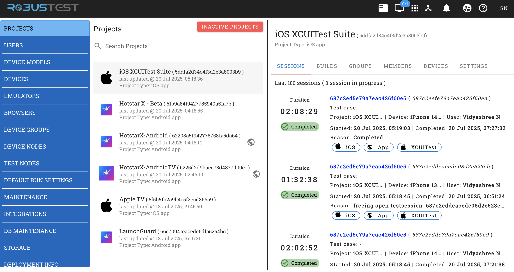

Admin Console - Project Sessions Management
===========================================

.. grid:: 1 1 1 1
   :margin: 4
   
   .. grid-item-card:: 📊 Project Sessions Overview
      :class-header: bg-primary text-white
      
      **Comprehensive Session Monitoring for Individual Projects**
      
      The Sessions tab within a project's Admin Console interface provides detailed session management and monitoring capabilities. This specialized view focuses exclusively on test session activity for the selected project, offering administrators granular control and insights into testing activities.

.. contents:: In this section
   :local:
   :depth: 3

Overview
--------

The Project Sessions interface is accessed through the **Sessions** tab when viewing a specific project in the Admin Console Projects section. This focused interface allows administrators to monitor, analyze, and manage all test sessions associated with the selected project.

**Key Capabilities:**

.. grid:: 3 3 2 1
   :margin: 4
   :gutter: 3

   .. grid-item-card:: 📈 Real-time Monitoring
      :class-header: bg-info text-white
      
      * Live session tracking
      * Active session counts
      * Progress monitoring
      * Performance metrics

   .. grid-item-card:: 📋 Session Management
      :class-header: bg-success text-white
      
      * Comprehensive session details
      * User and device tracking
      * Duration analysis
      * Status monitoring

   .. grid-item-card:: 🔍 Advanced Analytics
      :class-header: bg-warning text-white
      
      * Historical data access
      * Pattern identification
      * Resource optimization
      * Trend analysis

Accessing Project Sessions
--------------------------

.. note::
   **Navigation Path:** Admin Console → Projects → [Select Project] → Sessions Tab

To access the Project Sessions interface:

1. **Navigate to Admin Console**: Click the Admin Console icon in the platform header
2. **Select Projects Section**: Choose "Projects" from the left sidebar navigation
3. **Choose Target Project**: Select the desired project from the comprehensive projects list
4. **Access Sessions Tab**: Click on the "SESSIONS" tab to view session management interface

**Project Context Information:**

When viewing sessions for a specific project, the interface displays:

.. grid:: 2 2 1 1
   :margin: 4
   :gutter: 3

   .. grid-item-card:: 📱 Project Details
      :class-header: bg-secondary text-white
      
      * **Project Name**: Complete project identifier
      * **Project ID**: Unique hexadecimal reference
      * **Project Type**: Platform classification
      * **Last Updated**: Recent activity timestamp

   .. grid-item-card:: 📊 Session Statistics
      :class-header: bg-primary text-white
      
      * **Total Sessions**: Historical session count
      * **Active Sessions**: Real-time session monitoring
      * **Session History**: Last 100 sessions displayed
      * **Performance Metrics**: Duration and success rates

Session Management Interface
----------------------------

.. tabs::

   .. tab:: Session Overview

      **Project Session Dashboard:**
      
      The session management interface provides a comprehensive view of all testing activity for the selected project.
      
      .. grid:: 1 1 1 1
         :margin: 4
         
         .. grid-item-card:: 🎯 Current Project Context
            :class-header: bg-info text-white
            
            **Example Project: iOS XCUITest Suite**
            
            * **Project ID**: 5ddfa2d34c4f3d2e3a8003b9
            * **Project Type**: iOS app
            * **Session Display**: Last 100 sessions
            * **Active Monitoring**: Real-time session tracking

   .. tab:: Session Statistics

      **Real-time Session Metrics:**
      
      .. grid:: 2 2 1 1
         :margin: 4
         :gutter: 3
         
         .. grid-item-card:: 📈 Active Sessions
            :class-header: bg-success text-white
            
            * **Live Count**: Currently running sessions
            * **Progress Tracking**: Real-time monitoring
            * **Resource Usage**: Device allocation status
            * **Performance Metrics**: Live performance data
         
         .. grid-item-card:: 📊 Historical Data
            :class-header: bg-primary text-white
            
            * **Session Archive**: Last 100 sessions
            * **Trend Analysis**: Usage patterns
            * **Success Rates**: Completion statistics
            * **Duration Metrics**: Performance analysis

   .. tab:: Session Controls

      **Administrative Controls:**
      
      .. grid:: 3 3 2 1
         :margin: 4
         :gutter: 3
         
         .. grid-item-card:: ⚙️ Session Actions
            :class-header: bg-warning text-white
            
            * Session termination
            * Resource reallocation
            * Performance investigation
         
         .. grid-item-card:: 📋 Data Export
            :class-header: bg-info text-white
            
            * Session data export
            * Report generation
            * Analytics export
         
         .. grid-item-card:: 🔍 Search & Filter
            :class-header: bg-secondary text-white
            
            * Session filtering
            * User-based search
            * Device-based filtering

Session List Details
-------------------

**Session Entry Information:**

Each session entry provides comprehensive details:

**Primary Session Data:**
* **Duration**: Total session execution time (e.g., 02:08:29, 01:32:38, 02:02:52)
* **Session ID**: Unique identifier with clickable link (e.g., 687c2ed5e79a7eac426f60e5)
* **Test Case**: Associated test case information
* **Project**: Project name and identifier
* **Device**: Specific device used (e.g., iPhone 14, iPhone 13)
* **User**: User who initiated the session (e.g., Vidyashree N)

**Session Status Indicators:**
* **Completion Status**: Visual status indicator (✓ Completed)
* **Status Color Coding**: Green checkmark for completed sessions

**Timestamp Information:**
* **Started**: Session start time and date (e.g., 20 Jul 2025, 05:19:03)
* **Completed**: Session completion time and date (e.g., 20 Jul 2025, 07:27:32)

**Session Categorization:**
* **Platform Tags**: iOS, App, XCUITest framework indicators
* **Technology Badges**: Visual badges showing testing frameworks and platforms

**Termination Details:**
* **Reason**: Detailed termination reason (e.g., "Completed", "freeing open testsession")
* **Additional Context**: Additional session context and metadata

Session Types and Frameworks
----------------------------

**Supported Session Types:**

Based on the interface, the following session types are supported:

**Mobile Testing Frameworks:**
* **iOS Testing**: Native iOS application testing
* **XCUITest**: iOS automation framework sessions
* **Android Testing**: Android application testing sessions

**Session Categories:**
* **Manual Testing**: Interactive manual testing sessions
* **Automation Testing**: Automated test execution sessions
* **App Testing**: Mobile application testing sessions

Session Monitoring Features
---------------------------

**Real-time Session Tracking:**
* **Live Session Count**: Display of currently active sessions
* **Session Progress**: Real-time progress monitoring for ongoing sessions
* **Duration Tracking**: Precise timing for session duration measurement

**Session History Management:**
* **Historical Data**: Access to last 100 sessions per project
* **Session Archives**: Historical session data preservation
* **Search and Filter**: Ability to search through session history

**Performance Metrics:**
* **Session Duration**: Detailed timing analysis for performance optimization
* **Resource Utilization**: Device and resource usage tracking
* **Success/Failure Rates**: Session completion status tracking

Administrative Functions
------------------------

**Session Management Actions:**

Administrators can perform the following session-related actions:

**Session Control:**
* **Session Monitoring**: Real-time monitoring of active sessions
* **Session Termination**: Ability to terminate problematic sessions
* **Resource Management**: Monitor device and resource allocation

**Reporting and Analytics:**
* **Usage Analysis**: Detailed usage patterns and trends
* **Performance Reports**: Session performance and efficiency metrics
* **Resource Reports**: Device utilization and capacity planning

**Project Administration:**
* **Cross-Project Analysis**: Compare session patterns across projects
* **Team Performance**: Monitor team productivity and session usage
* **Resource Optimization**: Identify optimization opportunities

User Interface Features
-----------------------

**Navigation Elements:**
* **Breadcrumb Navigation**: Clear navigation path within admin console
* **Tab-based Interface**: Intuitive tab-based navigation between project sections
* **Search Functionality**: Quick search capabilities for finding specific projects or sessions

**Visual Design:**
* **Color-coded Status**: Green indicators for completed sessions
* **Platform Icons**: Clear visual indicators for iOS and Android platforms
* **Responsive Layout**: Optimized for different screen sizes and resolutions

**Data Presentation:**
* **Tabular Data**: Well-organized tabular presentation of session information
* **Clickable Elements**: Interactive elements for detailed session information
* **Real-time Updates**: Live updates of session status and progress

Best Practices for Session Management
-------------------------------------

**Monitoring Guidelines:**
* **Regular Monitoring**: Regularly monitor active sessions for performance issues
* **Resource Planning**: Use session data for resource capacity planning
* **Performance Analysis**: Analyze session durations for optimization opportunities

**Session Optimization:**
* **Duration Analysis**: Monitor session durations to identify performance bottlenecks
* **Device Utilization**: Optimize device allocation based on session patterns
* **Team Coordination**: Use session data to coordinate team activities

**Administrative Tasks:**
* **Regular Cleanup**: Periodically review and clean up old session data
* **Performance Tuning**: Use session metrics for system performance tuning
* **Capacity Planning**: Plan infrastructure capacity based on session usage patterns

Troubleshooting Session Issues
------------------------------

**Common Session Problems:**
* **Long-running Sessions**: Identify and investigate unusually long sessions
* **Failed Sessions**: Analyze failed sessions for pattern identification
* **Resource Conflicts**: Resolve device and resource allocation conflicts

**Resolution Strategies:**
* **Session Termination**: Terminate problematic or stuck sessions
* **Resource Reallocation**: Reallocate devices to resolve conflicts
* **Performance Investigation**: Investigate performance issues affecting sessions

Integration with Other Admin Functions
--------------------------------------

**Cross-functional Integration:**
* **Device Management**: Integration with device allocation and management
* **User Management**: Connection with user access and permission management
* **Resource Management**: Integration with overall resource planning and allocation

**Reporting Integration:**
* **Performance Reports**: Integration with system-wide performance reporting
* **Usage Analytics**: Connection with platform usage analytics and insights
* **Capacity Planning**: Integration with infrastructure capacity planning tools

.. seealso::
   
   **Related Admin Console Sections:**
   
   * :doc:`adminconsole` - Complete Admin Console overview and navigation
   * :doc:`projectdashboard` - Project Dashboard for individual project management
   * :doc:`liveview` - Live View capabilities for real-time session monitoring
   * :doc:`performancetesting` - Performance testing and monitoring features