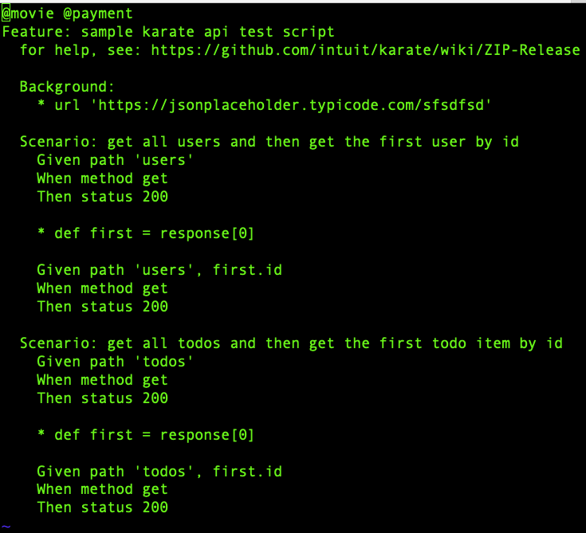

.. _hub-api:

Run API tests using Karate
==========================

.. role:: bolditalic
   :class: bolditalic

.. role:: underline
    :class: underline

RobusTest enables monitoring and viewing of automation test runs of API tests written using Cucumber/Gherkins [https://cucumber.io/docs/gherkin/] and run using Karate/Maven [https://github.com/karatelabs/karate]. In the following page, we shall walk you through the steps to run your API tests in such a way so that you can push the results to RobusTest.

**Pre-requisites:​**

**1.** Apache Maven should be installed on the system on which the tests are going to be run using Karate

**2.** The path to Apache Maven's '*bin*' folder should be added to your machine's *PATH* environment variable

   * if not added, you can do the same using the following command:

     * export PATH=$PATH:<path to Apache Maven bin folder>

**Steps for set up and execution:**

**1.** Obtain the latest version of the '*Karate-API-Testing*' zip file from your RobusTest Point of Contact

   * On request, RobusTest provides you with a custom zip file containing the libraries to run your Karate tests.
   * Download and unzip the file.
   * You should see a folder with the name '*Karate-API-Testing*'.

**2.** On Terminal, go to the folder '*Karate-API-Testing/src/test/java*'.

​
**3.** Open the file named **reportportal.properties** in edit mode and enter appropriate values for the following fields:

   * **rp.endpoint**

     * this will point to the robustest hub url
     * it will be of the form: *<RobusTest URL>/v2/hub e.g. http://devicelab.acme.com/v2/hub* 

   * **rp.launch** 

     * This value will the identifier for your test automation job. You can provide any custom string in this field.
     * All test runs that should be displayed under the same job should have the same value for this field.
   * **rp.project**
   
     * Project ID of the RobusTest project to which you wish to push your API test reports
   * **rp.description**
   
     * Description of the job that you are running the tests under
   * the *accessKey* parameter in **rp.attributesfield**
     * You can get your access key from your profile section on RobusTest
     * accessKey parameter is specified as a key value pair in rp.attributesfield
     * Notice the syntax of separating the attributes using semi colon

**4.** Place your feature files in the *Karate-API-Testing/src/test/java/features* folder

**5.** Executing your API Tests:
   * Go to the *Karate-API-Testing* folder and run the command **mvn clean test​**
   * This command cleans your 'target' folder and then executes your tests.
   * You should now see a job being executed in the Test Runs page of your RobusTest project.

**6.** Viewing your reports
   * On clicking on the job, you can see further details about the various API tests being executed
   * On clicking on an API test name you will reach the API test details page. Here: 

     a. you can find information about your test at a test step level
     b. you have the option to veiw the Karate logs

**Grouping API Tests**

* Sometimes you may want to group your tests under one or more tags. E.g. Payments, Login, Smoke, Regression, etc.
* You may want to use such tags to view only API tests relevant to you.
* RobusTest provides you a way to group your API tests the way you want.

**1.** In each feature file, provide the group name as an annotation in the first line : E.g. *@movie*

   * You can also provide more than one Test Group names separated by a space. E.g. *@movie @smoke* 
   * See the screenshot below for an example:

   
   Example of test group annotations using @movie and @smoke tags in test code

**2.** Now run your tests using the command: *mvn clean test​​​​*.

**3.** Go to the 'Test Cases' section of the job run report on RobusTest.

**4.** You can now use the '*Search*' bar to search using the Test Group required. E.g. on searching with '*movie*', all test cases that come under the 'movies' group are listed.

**5** Each test case is tagged with the annotations used for its feature files