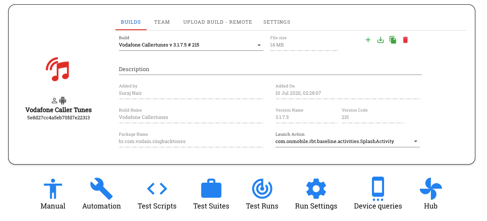

Project Dashboard
=================

.. contents:: Dashboard Overview
   :local:
   :depth: 2

The Project Dashboard is your central hub for managing all aspects of your testing project. It provides comprehensive information about your application under test, build details, team members, CI settings, and more.

.. grid:: 3 3 2 1

   .. grid-item-card:: 🏗️ Build Management
      :class-header: bg-primary text-white
      
      **Manage Your App Builds**
      
      * Upload new builds
      * View build information
      * Compare versions
      * Track build history

   .. grid-item-card:: 👥 Team Collaboration
      :class-header: bg-success text-white
      
      **Work With Your Team**
      
      * Add team members
      * Manage permissions
      * Share resources
      * Track activity

   .. grid-item-card:: ⚙️ Project Settings
      :class-header: bg-info text-white
      
      **Configure Your Project**
      
      * Set up notifications
      * Configure integrations
      * Manage access controls
      * Customize workflows

Dashboard Sections Overview
---------------------------

The Project Dashboard consists of 5 main sections designed to streamline your testing workflow:

.. tabs::

   .. tab:: 📱 Builds
      
      **Application Build Management**
      
      Manage application builds and versions with complete visibility into your app's evolution.
      
      * **Build Uploads**: Upload new builds manually or via API
      * **Version Control**: Track different versions and builds
      * **Build Information**: View comprehensive build metadata
      * **Build Actions**: Download, share, or delete builds

   .. tab:: 👥 Team
      
      **Team Member Management**
      
      Handle project members and permissions to ensure proper collaboration and access control.
      
      * **Member Management**: Add/remove team members
      * **Role Assignment**: Assign admin or regular member roles
      * **Permission Control**: Manage access to different features
      * **Activity Tracking**: Monitor team member activity

   .. tab:: 🔄 Remote Upload
      
      **Automated Build Integration**
      
      Automated build uploading via API for seamless CI/CD integration.
      
      * **API Commands**: Ready-to-use CURL commands
      * **CI/CD Integration**: Connect with your build pipeline
      * **Automation**: Automatic build uploads from your CI system
      * **Build Metadata**: Include build descriptions and labels

   .. tab:: ⚙️ Settings
      
      **Project Configuration**
      
      Configure project preferences and integrations to customize your testing environment.
      
      * **Notifications**: Set up build upload notifications
      * **Bug Tracker**: Configure external bug tracking systems
      * **Integrations**: Connect with third-party tools
      * **Project Preferences**: Customize project behavior

   .. tab:: 🔗 Groups
      
      **Device Organization**
      
      Organize devices and testing groups for efficient resource management.
      
      * **Device Groups**: Create logical device groupings
      * **Access Control**: Control which devices teams can access
      * **Resource Allocation**: Optimize device usage
      * **Group Management**: Add/remove devices from groups

Builds Section
--------------

This is the default landing section when you access a project, providing comprehensive build management capabilities.

.. grid:: 2 2 1 1

   .. grid-item-card:: 📊 Build Information Display
      :class-header: bg-primary text-white
      
      **What You'll See:**
      
      * **Build Details**: Name, version, and package information
      * **Technical Info**: Version code and launch activity
      * **Metadata**: Description, file size, and upload details
      * **History**: Uploader name and upload timestamp

   .. grid-item-card:: 🎯 Key Benefits
      :class-header: bg-success text-white
      
      **Why It Matters:**
      
      * **Version Control**: Track different app versions
      * **Team Visibility**: See who uploaded what and when
      * **Build Selection**: Easy switching between builds
      * **Metadata Management**: Rich build information storage

Build Information Display
-------------------------

The Builds section displays comprehensive information for each build in your project:

.. tabs::

   .. tab:: 📱 Build Details
      
      **Core Build Information**
      
      * **Build Name**: Descriptive name for easy identification
      * **Version Information**: Version name and code
      * **Package Details**: Application package name and structure
      * **Launch Activity**: Primary activity that starts the app
      
      .. tip::
         
         **Best Practice**: Use descriptive build names that include version numbers and build types (e.g., "MyApp_v2.1.0_Release")

   .. tab:: 📋 Build Metadata
      
      **Additional Build Information**
      
      * **Build Description**: Detailed description of build contents
      * **File Size**: Build file size for storage planning
      * **Uploader Information**: Team member who uploaded the build
      * **Upload Timestamp**: Date and time of build upload
      
      .. note::
         
         **Tracking**: All build uploads are tracked for audit purposes and team coordination

   .. tab:: 🔄 Build Status
      
      **Build State Information**
      
      * **Processing Status**: Build upload and processing state
      * **Availability**: Whether build is ready for testing
      * **Selection State**: Currently selected build for testing
      * **Usage Statistics**: How often the build has been tested

Multiple Build Management
-------------------------

You can upload and manage multiple builds within a single project for comprehensive version testing:

.. grid:: 2 2 1 1

   .. grid-item-card:: 📚 Build Organization
      :class-header: bg-info text-white
      
      **Multiple Build Benefits:**
      
      * **Version Comparison**: Test different versions side-by-side
      * **Regression Testing**: Compare new builds against previous versions
      * **A/B Testing**: Test different build variants
      * **Release Management**: Maintain stable and development builds

   .. grid-item-card:: 🔄 Build Selection
      :class-header: bg-warning text-white
      
      **Easy Build Switching:**
      
      * **Build Dropdown**: Use the Build dropdown to select which build to test
      * **Quick Access**: Switch between builds without re-uploading
      * **Context Preservation**: Maintain test configurations across builds
      * **Team Coordination**: All team members see the same build options

Available Actions
-----------------

The Builds section provides several management options to streamline your workflow:

.. grid:: 2 2 1 1

   .. grid-item-card:: 📤 Upload New Build
      :class-header: bg-primary text-white
      
      **Manual Build Upload**
      
      Manually upload an application build from your local system
      
      * **Supported Formats**: APK, IPA, ZIP files
      * **Build Validation**: Automatic validation during upload
      * **Metadata Entry**: Add descriptions and labels
      * **Team Notification**: Notify team members of new builds

   .. grid-item-card:: 🔗 Get Build URL
      :class-header: bg-success text-white
      
      **Build URL Access**
      
      Copy the download URL for the currently selected build to your clipboard
      
      * **Direct Download**: Share build links with team members
      * **External Access**: Access builds from external tools
      * **Version Control**: Maintain links to specific build versions
      * **Backup Access**: Alternative access method for builds

   .. grid-item-card:: 🆔 Copy Build ID
      :class-header: bg-info text-white
      
      **Build Identification**
      
      Copy the unique build identifier to your clipboard
      
      * **API Integration**: Use build IDs in API calls
      * **Automation**: Reference builds in automated scripts
      * **Tracking**: Unique identifier for each build
      * **CI/CD Integration**: Connect with continuous integration

   .. grid-item-card:: 🗑️ Delete Selected Build
      :class-header: bg-danger text-white
      
      **Build Cleanup**
      
      Remove the selected build from the project (admin privileges required)
      
      * **Storage Management**: Free up storage space
      * **Project Cleanup**: Remove outdated builds
      * **Admin Control**: Restricted to project administrators
      * **Safety Check**: Confirmation required before deletion

.. warning::
   
   **Admin Privileges Required**: Only project members with admin privileges can delete builds from the project. This prevents accidental deletion of important builds.

.. tip::
   
   **Build Management Best Practices:**
   
   * **Regular Cleanup**: Periodically remove old builds to save storage
   * **Descriptive Names**: Use clear, descriptive build names
   * **Version Control**: Maintain a logical versioning scheme
   * **Team Communication**: Notify team members about significant builds

Team Management
---------------

The Team section displays all project members and manages access permissions, enabling effective collaboration across your testing team.

.. grid:: 2 2 1 1

   .. grid-item-card:: 👥 Team Collaboration
      :class-header: bg-success text-white
      
      **What Team Members Can Do:**
      
      * **Build Access**: Test any build within the project
      * **Automation**: Create and run automation scripts
      * **Reports**: View and generate comprehensive test reports
      * **Collaboration**: Work together on test case development

   .. grid-item-card:: 🔐 Access Control
      :class-header: bg-primary text-white
      
      **Permission Management:**
      
      * **Role-Based Access**: Admin and regular member roles
      * **Granular Permissions**: Control what each member can do
      * **Security**: Prevent unauthorized changes
      * **Audit Trail**: Track member activities

Team Member Capabilities
-------------------------

All project members have access to core testing functionality:

.. tabs::

   .. tab:: 🧪 Testing Capabilities
      
      **Core Testing Functions**
      
      * **Build Testing**: Test any build within the project
      * **Device Access**: Use project devices for testing
      * **Session Management**: Create and manage test sessions
      * **Data Collection**: Capture screenshots, videos, and logs
      
      .. tip::
         
         **Collaboration**: Team members can see each other's test sessions and results for better coordination

   .. tab:: 🤖 Automation Features
      
      **Automated Testing**
      
      * **Script Creation**: Create and run automation scripts
      * **Test Execution**: Execute automated test suites
      * **Scheduling**: Schedule automated test runs
      * **Result Analysis**: Analyze automation results
      
      .. note::
         
         **Automation Access**: All team members can create and run automation, promoting team-wide adoption

   .. tab:: 📊 Reporting & Analytics
      
      **Test Reports**
      
      * **Test Reports**: View and generate comprehensive test reports
      * **Performance Analytics**: Access performance metrics and insights
      * **Trend Analysis**: Track testing trends over time
      * **Export Options**: Export reports in various formats
      
      .. tip::
         
         **Shared Insights**: Reports are available to all team members for transparency

   .. tab:: 🤝 Collaboration Tools
      
      **Team Coordination**
      
      * **Test Case Development**: Collaborate on test case creation
      * **Knowledge Sharing**: Share testing insights and findings
      * **Communication**: Built-in commenting and notification features
      * **Version Control**: Track changes and versions collaboratively

Member Roles and Permissions
-----------------------------

Projects support two types of members with different privilege levels:

.. tabs::

   .. tab:: 👑 Admin Members
      
      **Enhanced Privileges**
      
      Admin members have comprehensive project management capabilities:
      
      .. grid:: 2 2 1 1
      
         .. grid-item-card:: 🛠️ Project Management
            :class-header: bg-danger text-white
            
            **Administrative Powers:**
            
            * **Build Management**: Delete builds from the project
            * **Team Control**: Add or remove team members
            * **Permission Management**: Grant or revoke admin privileges
            * **Project Settings**: Configure project preferences
         
         .. grid-item-card:: 🔧 Technical Access
            :class-header: bg-warning text-white
            
            **Advanced Features:**
            
            * **API Access**: Execute CURL commands for remote build uploads
            * **Integration Setup**: Configure external tool integrations
            * **Advanced Settings**: Access all project configuration options
            * **Audit Controls**: View detailed audit logs and activity

   .. tab:: 👤 Regular Members
      
      **Standard Access**
      
      Regular members can perform standard testing activities:
      
      .. grid:: 2 2 1 1
      
         .. grid-item-card:: ✅ What They Can Do
            :class-header: bg-success text-white
            
            **Testing Activities:**
            
            * **Test Execution**: Run manual and automated tests
            * **Build Testing**: Test all available builds
            * **Report Generation**: Create and view test reports
            * **Collaboration**: Work with team members on testing
         
         .. grid-item-card:: ❌ What They Cannot Do
            :class-header: bg-secondary text-white
            
            **Restricted Actions:**
            
            * **Project Structure**: Cannot modify project structure
            * **Team Management**: Cannot add/remove team members
            * **Build Deletion**: Cannot delete builds
            * **Admin Settings**: Cannot access admin-only features

.. grid:: 2 2 1 1

   .. grid-item-card:: 🔑 Automatic Admin Rights
      :class-header: bg-info text-white
      
      **Project Creator Privileges**
      
      The project creator automatically receives admin privileges and has full control over the project.
      
      **This includes:**
      
      * Full administrative access
      * Ability to grant admin rights to others
      * Complete project control
      * Cannot have admin rights revoked

   .. grid-item-card:: ⚖️ Admin Types Explained
      :class-header: bg-warning text-white
      
      **Project Admin vs. RobusTest Admin**
      
      **Project Admin**: Limited to their specific project
      **RobusTest Admin**: Platform-wide administrative access
      
      **Key Difference:**
      
      * Project Admins: Single project scope
      * RobusTest Admins: Cross-project access

.. admonition:: 🔒 Security Best Practices
   :class: tip
   
   **Team Management Tips:**
   
   * **Principle of Least Privilege**: Grant minimum necessary permissions
   * **Regular Reviews**: Periodically review team member access
   * **Admin Assignments**: Carefully consider who gets admin privileges
   * **Activity Monitoring**: Monitor team member activities for security

Remote Build Upload (API)
-------------------------

.. note::
   **Admin Only**: This section is only visible to project admin members for security reasons.

The Remote Build Upload section provides powerful API capabilities for automating build uploads to your project, enabling seamless CI/CD integration.

.. grid:: 2 2 1 1

   .. grid-item-card:: 🔄 CI/CD Integration
      :class-header: bg-primary text-white
      
      **Automated Build Pipeline**
      
      * **Continuous Integration**: Automatically upload builds from CI systems
      * **Build Automation**: Trigger uploads after successful builds
      * **Pipeline Integration**: Connect with Jenkins, GitLab CI, GitHub Actions
      * **Workflow Automation**: Reduce manual upload steps

   .. grid-item-card:: 🚀 Key Benefits
      :class-header: bg-success text-white
      
      **Why Use API Upload**
      
      * **Time Savings**: Eliminate manual upload steps
      * **Consistency**: Ensure all builds follow the same process
      * **Reliability**: Reduce human error in build management
      * **Scalability**: Handle multiple projects and builds efficiently

API Command Structure
---------------------

The Remote Build Upload uses a standardized CURL command format:

.. code-block:: bash

   curl -X PUT '<RobusTest URL>/v3/project/<PROJECT IDENTIFIER>/build?accesskey=<USER ACCESS KEY>' \
        -H 'content-Type: multipart/form-data' \
        -F 'build=@<BUILD NAME WITH PATH>' \
        -F 'buildInfo={"desc":"<build description>", "label":"<label>","activityClass":"<launch activity>"}'

Command Parameters Explained
-----------------------------

Let's break down each component of the API command:

.. tabs::

   .. tab:: 🌐 RobusTest URL
      
      **Platform Access URL**
      
      The URL that you use to access the RobusTest platform
      
      **Format Examples:**
      
      * **IP-based**: `http://192.168.1.100:8085`
      * **Domain-based**: `http://robustest.company.com:8085`
      * **Secure**: `https://robustest.company.com`
      
      .. tip::
         
         **Finding Your URL**: Use the same URL you access RobusTest from your browser

   .. tab:: 🆔 Project Identifier
      
      **Project ID Extraction**
      
      The unique identifier for your project, extracted from the dashboard URL
      
      **How to Find:**
      
      1. Go to your Project Dashboard
      2. Look at the URL: `<RobusTest URL>/#/project/<Project ID>/dashboard`
      3. Copy the Project ID from the URL
      
      **Example:**
      
      * **URL**: `http://robustest.company.com:8085/#/project/5d176ffef0238be8f3b7afa5/dashboard`
      * **Project ID**: `5d176ffef0238be8f3b7afa5`

   .. tab:: 🔑 User Access Key
      
      **Authentication Token**
      
      Each user has a unique access key for API authentication
      
      **Key Features:**
      
      * **User-Specific**: Each team member has their own key
      * **Build Attribution**: Uploads are attributed to the key owner
      * **Security**: Secure authentication method
      * **Customizable**: Can use different team member keys
      
      .. seealso::
         
         See :ref:`user-profile` for details on obtaining your User Access Key

   .. tab:: 📁 Build Path
      
      **Build File Location**
      
      The path to your build file on the filesystem
      
      **Examples:**
      
      * **Absolute Path**: `/home/user/builds/app-v1.2.3.apk`
      * **Relative Path**: `./builds/latest.apk`
      * **CI Path**: `$WORKSPACE/app/build/outputs/apk/release/app-release.apk`
      
      .. tip::
         
         **CI Integration**: Use environment variables for dynamic paths

   .. tab:: 📋 Build Metadata
      
      **Optional Build Information**
      
      Additional details about the build (JSON format)
      
      **Available Fields:**
      
      * **desc**: Build description
      * **label**: Build label/version
      * **activityClass**: Launch activity
      
      **Example:**
      
      .. code-block:: json
      
         {
           "desc": "Release build v1.2.3 - Bug fixes",
           "label": "v1.2.3",
           "activityClass": "com.example.MainActivity"
         }

Sample Implementation
---------------------

Here's a complete example of the remote build upload command:

.. code-block:: bash

   curl -X PUT 'http://robustest.company.com:8085/v3/project/5d176ffef0238be8f3b7afa5/build?accesskey=aY33cDmkt7B2nAjxBl6Tp2FWv4' \
        -H 'content-Type: multipart/form-data' \
        -F 'build=@/builds/myapp-v1.2.3.apk' \
        -F 'buildInfo={"desc":"Release build v1.2.3 with bug fixes", "label":"v1.2.3"}'

CI/CD Integration Examples
--------------------------

.. tabs::

   .. tab:: 🔧 Jenkins Integration
      
      **Jenkins Pipeline Example**
      
      .. code-block:: groovy
      
         pipeline {
             agent any
             stages {
                 stage('Build') {
                     steps {
                         // Your build steps here
                         sh './gradlew assembleRelease'
                     }
                 }
                 stage('Upload to RobusTest') {
                     steps {
                         script {
                             def buildPath = "app/build/outputs/apk/release/app-release.apk"
                             def buildInfo = """{"desc":"Jenkins build ${BUILD_NUMBER}", "label":"${BUILD_TAG}"}"""
                             
                             sh """
                                 curl -X PUT '${ROBUSTEST_URL}/v3/project/${PROJECT_ID}/build?accesskey=${ACCESS_KEY}' \
                                      -H 'content-Type: multipart/form-data' \
                                      -F 'build=@${buildPath}' \
                                      -F 'buildInfo=${buildInfo}'
                             """
                         }
                     }
                 }
             }
         }

   .. tab:: 🐙 GitHub Actions
      
      **GitHub Actions Workflow**
      
      .. code-block:: yaml
      
         name: Build and Upload to RobusTest
         
         on:
           push:
             branches: [ main ]
         
         jobs:
           build-and-upload:
             runs-on: ubuntu-latest
             steps:
               - uses: actions/checkout@v2
               
               - name: Build APK
                 run: ./gradlew assembleRelease
               
               - name: Upload to RobusTest
                 run: |
                   curl -X PUT '${{ secrets.ROBUSTEST_URL }}/v3/project/${{ secrets.PROJECT_ID }}/build?accesskey=${{ secrets.ACCESS_KEY }}' \
                        -H 'content-Type: multipart/form-data' \
                        -F 'build=@app/build/outputs/apk/release/app-release.apk' \
                        -F 'buildInfo={"desc":"GitHub Actions build ${{ github.run_number }}", "label":"${{ github.sha }}"}'

   .. tab:: 🦊 GitLab CI
      
      **GitLab CI Pipeline**
      
      .. code-block:: yaml
      
         stages:
           - build
           - upload
         
         build:
           stage: build
           script:
             - ./gradlew assembleRelease
           artifacts:
             paths:
               - app/build/outputs/apk/release/app-release.apk
         
         upload_to_robustest:
           stage: upload
           script:
             - |
               curl -X PUT "${ROBUSTEST_URL}/v3/project/${PROJECT_ID}/build?accesskey=${ACCESS_KEY}" \
                    -H 'content-Type: multipart/form-data' \
                    -F 'build=@app/build/outputs/apk/release/app-release.apk' \
                    -F "buildInfo={\"desc\":\"GitLab CI build ${CI_PIPELINE_ID}\", \"label\":\"${CI_COMMIT_SHORT_SHA}\"}"

   .. tab:: 🔄 Generic Script
      
      **Shell Script Example**
      
      .. code-block:: bash
      
         #!/bin/bash
         
         # Configuration
         ROBUSTEST_URL="http://robustest.company.com:8085"
         PROJECT_ID="5d176ffef0238be8f3b7afa5"
         ACCESS_KEY="aY33cDmkt7B2nAjxBl6Tp2FWv4"
         BUILD_PATH="/path/to/your/build.apk"
         
         # Build information
         BUILD_DESC="Automated build $(date '+%Y-%m-%d %H:%M:%S')"
         BUILD_LABEL="v$(cat version.txt)"
         
         # Upload command
         curl -X PUT "${ROBUSTEST_URL}/v3/project/${PROJECT_ID}/build?accesskey=${ACCESS_KEY}" \
              -H 'content-Type: multipart/form-data' \
              -F "build=@${BUILD_PATH}" \
              -F "buildInfo={\"desc\":\"${BUILD_DESC}\", \"label\":\"${BUILD_LABEL}\"}"
         
         echo "Build uploaded successfully!"

Best Practices
--------------

.. grid:: 2 2 1 1

   .. grid-item-card:: 🔒 Security Best Practices
      :class-header: bg-danger text-white
      
      **Protect Your Credentials**
      
      * **Environment Variables**: Store access keys in environment variables
      * **Secret Management**: Use CI/CD secret management systems
      * **Key Rotation**: Regularly rotate access keys
      * **Access Control**: Limit who has access to API keys
      
      .. warning::
         
         **Never commit access keys to version control**

   .. grid-item-card:: 🚀 Automation Best Practices
      :class-header: bg-success text-white
      
      **Optimize Your Workflow**
      
      * **Build Validation**: Verify build success before upload
      * **Error Handling**: Implement proper error handling
      * **Notifications**: Set up notifications for upload status
      * **Metadata**: Include meaningful build descriptions
      
      .. tip::
         
         **Test Automation**: Trigger automated tests after successful uploads

**4. Settings**

This section provides you the following options:

**a.** **Enable notifications** - On enabling this checkbox, each member of the team is notified whenever a new build is uploaded to the project

**b.** **Choose Bug Tracker configuration** - RobusTest supports Continuous Integration with your existing CI tools through APIs. 

Once you have integrated your Bug Tracker tool wih RobusTest, this configuration will be available for selection in the 'Bug Tracker' drop down. Once the required configuration is selected, all bugs encountered during your testing can be logged directly, from RobusTest, into the tool of your choice.

You can configure your project with the tool of your choice through the 'Integration' section of the RobusTest Admin Console.
