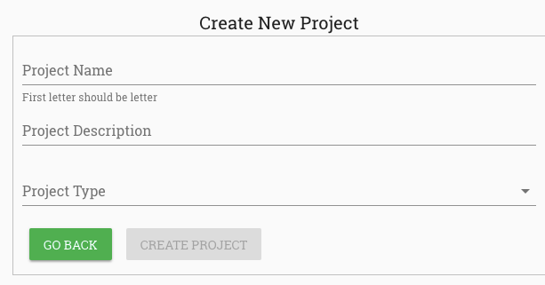

Creating Projects
=================

.. note::
   
   **Quick Start Overview**
   
   Creating a project on RobusTest is your first step towards comprehensive mobile app testing. This process typically takes 2-3 minutes and sets up your complete testing workspace.

On RobusTest, all activity related to the testing of a mobile app will be part of a *Project*. 

A Project is a logical workspace that contains all builds, test cases, test suites, test runs and test reports associated with your application testing. It also facilitates team collaboration and project organization.

.. contents:: In this section
   :local:
   :depth: 2

Creating a New Project
----------------------

.. admonition:: Step-by-Step Process
   :class: important

   Follow these steps to create your first project:

**Step 1: Access Project Creation**

After logging into RobusTest, click the **Create Project** button on the landing page.

**Step 2: Configure Project Settings**

On the **Create New Project** page, provide the following information:

.. list-table:: Project Configuration
   :header-rows: 1
   :widths: 25 50 25

   * - Field
     - Description
     - Required
   * - **Project Name**
     - Usually the name of your application under test (AUT)
     - ✅ Yes
   * - **Project Description**
     - Brief description of the project's purpose and scope
     - ❌ Optional
   * - **Project Type**
     - Choose from 4 available project types (see below)
     - ✅ Yes

**Project Type Selection**

Choose the appropriate project type based on your testing needs:

.. grid:: 2 2 1 1

   .. grid-item-card:: 📱 Android App Project
      :class-header: bg-success text-white
      
      For testing Android applications
      
      **Supported Formats**: .apk or .zip files
      
      **Use Cases**: Native Android apps, hybrid apps
      
   .. grid-item-card:: 🍎 iOS App Project
      :class-header: bg-primary text-white
      
      For testing iOS applications
      
      **Supported Formats**: .ipa or .zip files
      
      **Use Cases**: Native iOS apps, hybrid apps

   .. grid-item-card:: 🌐 Mobile Web App Project
      :class-header: bg-info text-white
      
      For testing mobile web applications
      
      **Supported Formats**: Web URLs
      
      **Use Cases**: Progressive Web Apps, responsive websites
      
   .. grid-item-card:: 📟 Device Only Project
      :class-header: bg-warning text-white
      
      For device-specific testing
      
      **Supported Features**: Calls, SMS, device functions
      
      **Use Cases**: Device validation, hardware testing

For detailed information about each type, see: :doc:`projecttypes`

**Step 3: Complete Project Creation**

Click the **Create Project** button. You will be redirected to the newly created Project Dashboard.

.. image:: _static/projectdashboard.png
   :align: center
   :alt: Project Dashboard Example

.. note::
   
   🎉 **Project Created Successfully!**
   
   Your project workspace is now ready. The Project Dashboard provides access to all testing features and project management tools.

Uploading Your Application Build
--------------------------------

.. admonition:: Build Upload Process
   :class: important

   The next step is to upload your application build for testing.

**Step 4: Upload Your Build**

After creating a project, upload your application build for testing:

.. tabs::

   .. tab:: Android Projects
      
      **Supported Formats**: .apk or .zip files
      
      1. Click the **Upload new build** button (the '+' icon) on the Project Dashboard
      2. Select your APK or ZIP file from your computer
      3. Add build description and version information
      4. Click **Upload** to complete the process
      
      .. tip::
         
         **APK vs ZIP**: Use ZIP files when you have multiple APK files or additional resources to upload together.

   .. tab:: iOS Projects
      
      **Supported Formats**: .ipa or .zip files
      
      1. Click the **Upload new build** button (the '+' icon) on the Project Dashboard
      2. Select your IPA or ZIP file from your computer
      3. Add build description and version information
      4. Click **Upload** to complete the process
      
      .. tip::
         
         **IPA vs ZIP**: Use ZIP files when you have multiple IPA files or additional resources to upload together.

   .. tab:: Web App & Device Only
      
      **Build Upload**: Not applicable
      
      .. note::
         
         This step is not applicable to Mobile Web App and Device Only projects.
         
         * **Web App projects**: Configure web URLs in project settings
         * **Device Only projects**: Ready for testing immediately

Next Steps
----------

.. important::
   
   🎉 **Congratulations!** Your project is now ready for testing!

**What's Next?**

Choose your testing approach based on your needs:

.. grid:: 1 2 2 2

   .. grid-item-card:: 🚀 Start Testing Immediately
      :class-header: bg-success text-white
      
      Jump right into testing with your uploaded build
      
      ➡️ :doc:`manualtesting`
      
   .. grid-item-card:: 🔄 Set Up Automation
      :class-header: bg-primary text-white
      
      Configure automated testing workflows
      
      ➡️ Ready to set up automated testing workflows
      
   .. grid-item-card:: 🏗️ CI/CD Integration
      :class-header: bg-info text-white
      
      Integrate with your development pipeline
      
      ➡️ :doc:`continuousintegration`
      
   .. grid-item-card:: 📊 Understand Your Dashboard
      :class-header: bg-warning text-white
      
      Learn about project management features
      
      ➡️ :doc:`projectdashboard`

Project Best Practices
----------------------

.. admonition:: Pro Tips for Success
   :class: tip

   Follow these best practices to get the most out of your RobusTest project:

**📝 Naming Conventions**

.. list-table::
   :header-rows: 1
   :widths: 30 70

   * - Recommendation
     - Example
   * - Use descriptive project names
     - "MyApp_Android_v2.1" or "ECommerce_iOS_Production"
   * - Include version information
     - "ShoppingApp_v3.2_Beta" or "NewsApp_Release_2024"
   * - Environment specification
     - "MyApp_Staging" or "MyApp_Production"

**👥 Team Organization**

**Early Collaboration**

* Add team members immediately after project creation
* Assign appropriate admin privileges
* Set up notification preferences

**Environment Management**

* Create separate projects for different environments
* Use consistent naming across environments
* Maintain clear project ownership

**📱 Build Management**

.. tabs::

   .. tab:: Upload Strategy
      
      * Upload builds with descriptive labels and version information
      * Include build notes and change logs
      * Tag builds with feature information
      
   .. tab:: Maintenance
      
      * Maintain a clean build history by removing outdated builds
      * Keep 3-5 most recent builds for comparison
      * Archive old builds rather than deleting them
      
   .. tab:: Automation
      
      * Set up remote upload API for CI/CD integration
      * Automate build uploads from your pipeline
      * Configure automatic notifications for new builds

.. attention::
   
   **Quick Start Checklist**:
   
   ✅ Choose a descriptive project name
   
   ✅ Upload your first build immediately
   
   ✅ Invite team members early
   
   ✅ Configure notification preferences
   
   ✅ Set up CI/CD integration (optional)

.. seealso::
   
   **Additional Resources**:
   
   * :doc:`projecttypes` - Detailed information about each project type
   * :doc:`runsettings` - Configure test execution settings
   * :doc:`scheduling` - Set up automated test scheduling
   * :doc:`bugtrackerintegration` - Integrate with your bug tracking system
