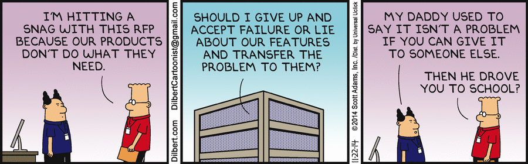

Troubleshooting
===============

.. toctree::
   :maxdepth: 1
   :hidden:
   
   unabletoaccessRobusTestserver

.. contents:: In this section
   :local:
   :depth: 2

`Image credit-Dilbert`_

.. _Image credit-Dilbert: http://dilbert.com/strip/2014-11-22

Overview
--------

This troubleshooting guide addresses common issues you may encounter while using RobusTest. These solutions cover the most frequently reported problems and their resolutions.

**Getting Additional Help:**

If you don't find your specific issue here, please `log a support ticket <http://robustest.freshdesk.com>`_ for personalized assistance from our technical support team.

Common Issues and Solutions
--------------------------

**Unable to Reach Node Server**

**Issue**: Clicking on Manual or Automation buttons shows "Unable to reach node server" message.

**Cause**: Your computer is accessing RobusTest through a proxy server that blocks WebSocket protocol.

**Solutions**:

1. **Configure Proxy Settings**: Contact your network administrator to allow WebSocket connections
2. **Bypass Proxy**: If possible, temporarily bypass the proxy for RobusTest access
3. **Alternative Ports**: Try accessing RobusTest through alternative ports that may not be blocked
4. **VPN Solution**: Use a VPN connection that doesn't block WebSocket traffic

**Verification**: Test WebSocket connectivity using browser developer tools or online WebSocket test tools.

**No Live View for Hub Tests**

**Issue**: Automation tests run on RobusTest Hub but don't appear in Live View.

**Cause**: Build URL mismatch - the build URL you're using belongs to another user.

**Solutions**:

1. **Verify Build URL**: Ensure you're using the correct build URL generated for your account
2. **Check User Access**: Confirm you have access to the project containing the build
3. **Regenerate URL**: Create a new build URL from your project dashboard
4. **User Permissions**: Verify your user permissions allow access to the specific project

**Verification**: Check that the build appears in your project's build list.

**Live View Test Steps Not Visible**

**Issue**: Unable to see test steps in Live View for your device.

**Cause**: Firewall is blocking test step execution information.

**Diagnosis**:

.. code-block:: bash

   # Test connectivity to RobusTest server
   telnet <RobusTest_Installation_Address> <port_number>

**Solutions**:

1. **Firewall Configuration**: Contact your network administrator to open required ports
2. **Port Testing**: Test specific ports used by RobusTest Live View
3. **Alternative Access**: Use a different network connection to bypass firewall restrictions
4. **VPN Access**: Connect through a VPN that doesn't have these restrictions

**Required Ports**: Ensure the following ports are open:
- HTTP: 80/443
- WebSocket: 8080/8443
- Live View: Custom ports (contact support for specifics)

**Unable to Access RobusTest**

**Issue**: Cannot access RobusTest platform at all.

**Diagnosis Steps**:

1. **Network Connectivity**: Verify your computer is connected to the network
2. **Server Reachability**: Test server connectivity:

.. code-block:: bash

   # Test basic connectivity
   ping <RobusTest_server_IP_address>

   # Test HTTP connectivity
   curl -I <RobusTest_server_URL>

   # Test specific port
   telnet <RobusTest_server_IP> <port>

**Solutions**:

1. **Network Issues**: 
   - Check your internet connection
   - Verify DNS resolution
   - Try accessing from a different network

2. **Server Issues**:
   - Server may be down for maintenance
   - Contact your RobusTest administrator
   - Check server status page (if available)

3. **Firewall/Proxy Issues**:
   - Configure proxy settings
   - Whitelist RobusTest domains
   - Open required ports

4. **Browser Issues**:
   - Clear browser cache and cookies
   - Try a different browser
   - Disable browser extensions

Performance Issues
~~~~~~~~~~~~~~~~~~

.. admonition:: ⚡ Performance Problem
   :class: warning
   
   **Issue**: RobusTest is slow or unresponsive.

**Common Causes and Solutions**:

1. **Network Latency**:
   - Check your internet speed
   - Use a wired connection instead of Wi-Fi
   - Move closer to your router

2. **Browser Performance**:
   - Close unnecessary browser tabs
   - Clear browser cache
   - Update to the latest browser version

3. **Device Resource Issues**:
   - Close other applications
   - Restart your computer
   - Check available RAM and CPU usage

4. **Server Load**:
   - Try accessing during off-peak hours
   - Contact support if persistent

Device Connection Issues
~~~~~~~~~~~~~~~~~~~~~~~~

.. admonition:: 📱 Device Connectivity Problem
   :class: warning
   
   **Issue**: Devices not appearing or showing as disconnected.

**Solutions**:

1. **Device Status**: Check device status on the Health Page
2. **USB Connection**: Ensure USB debugging is enabled (for local devices)
3. **Network Issues**: Verify network connectivity between device and server
4. **Device Restart**: Restart the device and try reconnecting
5. **Node Status**: Check if the node hosting the device is online

Test Execution Failures
~~~~~~~~~~~~~~~~~~~~~~~

.. admonition:: 🧪 Test Execution Problem
   :class: warning
   
   **Issue**: Tests fail to execute or complete.

**Common Solutions**:

1. **App Installation**: Ensure the app is properly installed on the device
2. **Permissions**: Verify app has required permissions
3. **Device Compatibility**: Check device compatibility with your app
4. **Test Script Issues**: Review test scripts for errors
5. **Resource Availability**: Ensure device has sufficient resources

Best Practices for Troubleshooting
~~~~~~~~~~~~~~~~~~~~~~~~~~~~~~~~~~

.. admonition:: 💡 Pro Troubleshooting Tips
   :class: tip
   
   **Effective Troubleshooting Strategy:**
   
   1. **Document Issues**: Keep track of error messages and steps that led to the problem
   2. **Check Logs**: Review browser console logs and RobusTest logs
   3. **Isolate Problems**: Try to reproduce the issue in a controlled environment
   4. **Update Software**: Keep your browser and operating system updated
   5. **Contact Support**: Don't hesitate to contact support with detailed information

Getting Help
~~~~~~~~~~~~

.. admonition:: 🆘 Support Request Checklist
   :class: important
   
   **When contacting support, please provide**:
   
   - 📝 **Detailed description of the issue**
   - 🔄 **Steps to reproduce the problem**
   - 📷 **Screenshots or error messages**
   - 💻 **Browser and operating system information**
   - 🌐 **Network configuration details (if relevant)**

.. seealso::
   
   **Related Topics:**
   
   * :doc:`userprofile` - Accessing support and help resources
   * :doc:`healthpage` - Monitoring device and node status
   * :doc:`unabletoaccessRobusTestserver` - Detailed server access troubleshooting
     unreachable or that the server is down. Please check on this with your IT team
     If the ping command is successful and you are able to reach the server, then we check if the RobusTest server is running 
     successfully.
     
     Visit the RobusTest processes page and ensure that all processes are running as expected
     The URL for RobusTest processes page looks as below
     
     http://<robustest server url>:9001

     Make sure all the processes are in running state. 
     In case the URL above is not reachable, it means the RobusTest server is not running.
     Start the RobusTest application by running the following command on the system. You will need to login to the RobusTest server 
     using putty or similar tool.

      # cd /opt/code/RobusTest
      # screen -S FrontEnd
      # sudo su (enter the password when prompted)
      # ./StartServer.sh

   To find out the IP addresses of the deployment servers other such details, please contact your RobusTest administrator.

   Issue: :ref:`unable-to-access-RobusTest-server`
